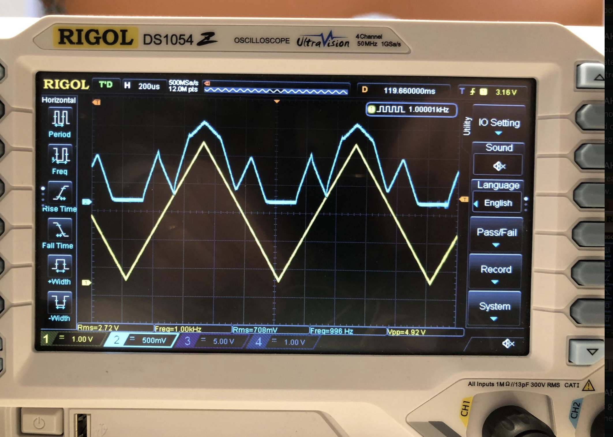

# Four-segment transfer function generator

 
 

[Phil Julian](https://philjulian.bandcamp.com/) was interested in having a workalike of the [Comdyna 709 function generator](http://www.analogmuseum.org/library/comdyna_functiongenerators.pdf) for his synthesizer. I was reminded of some circuits from Jim Patchell's [ideal diode tutorial](https://schmitzbits.de/diode_tutorial/index.html).

After thinking about it for a while I realised it could be done a bit more simply than the obvious ideal diode-based implementation and came up with this circuit which I am currently testing out. 

## Rough Description

Input is a signal 0 - 5V. For the sake of example suppose this is a simple ramp from 0 to 5V.

There are four *breakpoints* set by CV inputs or knobs. As the input ramp reaches each breakpoint, it is subjected to a different *gain*: the four gains (one for each breakpoint) are also set by CV inputs / knobs.

If we set breakpoints at 1V, 2V, 3V and 4V, with gains of 3, -4, 2 and -1 for example, the output signal should look like:
 - with input from 0-1V, stay flat at zero
 - with input from 1-2V, rise at a rate of 3V per volt of input, resulting in a rise from 0 to 3V
 - with input from 2-3V, fall at a rate of 4V per volt of input, resulting in a fall from 3V to -1V
 - with input from 3-4V, rise at a rate of 2V per volt of input, resulting in a rise from -1V to 1V
 - with input from 4-5V, fall at a rate of 1V per volt of input, resulting in a fall from 1V to 0V

If the input goes above 5V, the output will keep falling at 1V per volt. At least, that's the idea. 

## Build documents:

 - [Bill of materials](breakpoints-bom.pdf) 
 - [Interactive BOM](ibom.html) to help place the parts (experimental!)

## Setup and trimming:
 
 For v1.1 boards: 
 
 These instructions are to trim out any offsets on the LM13700s. This can be done with the main board disconnected from any controls. If you have controls connected, set all the gain and breakpoint controls to zero.

 Generate a test signal around 1kHz with a negative component. I use my function generator to create a 1kHz square wave from 0 to -5V. Anything with a significant negative voltage would be fine. 
 
 Monitor pad T on an oscilloscope.
 
 - Send the signal to pad H or G. Adjust TR4 for the flattest possible output.
 - Send the signal to pad F or E. Adjust TR3 for the flattest possible output.
 - Send the signal to pad D or C. Adjust TR2 for the flattest possible output.
 - Send the signal to pad A or B. Adjust TR1 for the flattest possible output. 
 
The offsets add up through the stages so you have to do it in this order. 

 
 
